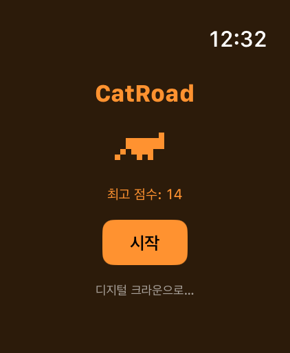
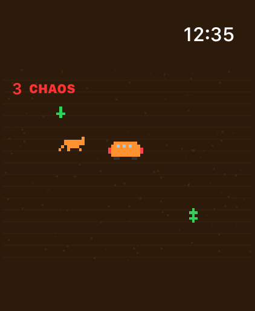
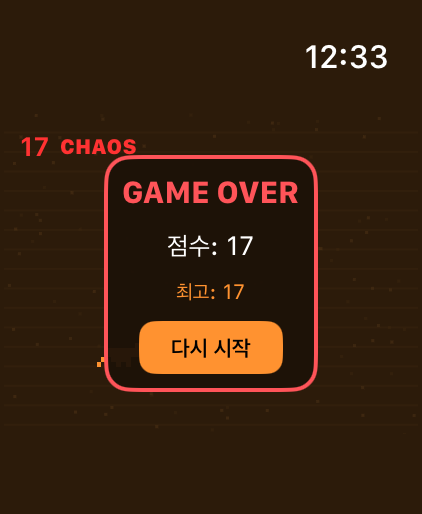

# CatRoad

<p align="center">
  
</p>

Apple Watch pixel runner game. Dodge obstacles with the Digital Crown.

> App icon generated with [Google Gemini](https://gemini.google.com/)

## Screenshots

| Start | Gameplay | Game Over |
|:---:|:---:|:---:|
|  |  |  |

## Features

- Pixel art cat with walk animation
- 4 obstacle types: small cactus, large cactus, rock, school bus
- Digital Crown + drag gesture controls
- Progressive difficulty (speed, spawn rate, burst spawning)
- Chaos Mode easter egg (triple-tap score)
- High score persistence
- Haptic feedback (game over, chaos mode)
- 8 languages (EN, KO, ZH, ES, JA, FR, DE, PT-BR)

## Requirements

- macOS 14.0+
- Xcode 15.0+
- iOS 16.0+ / watchOS 9.0+

## Quick Start

```bash
# Clone
git clone https://github.com/haedoang/CatRoad.git
cd CatRoad

# Open in Xcode
open CatRoad.xcodeproj
```

### Build & Run

1. Select scheme: **CatRoad Watch App** (top left)
2. Select destination: **Apple Watch Ultra** or any Watch simulator
3. Press `Cmd + R` to run

### Run Tests (no simulator needed)

```bash
cd Packages/CatRoadKit
swift test
```

## Project Structure

```
CatRoad/
├── CatRoad/                        # iOS companion app
│   ├── CatRoadApp.swift            # @main entry point
│   └── ContentView.swift           # Usage guide screen
│
├── CatRoad Watch App/              # watchOS app (SwiftUI)
│   ├── CatRoadApp.swift            # @main entry point
│   ├── ContentView.swift           # StartView, GameView, GameOverView
│   ├── Localizable.xcstrings       # String Catalog (8 languages)
│   └── Assets.xcassets/
│
├── Packages/CatRoadKit/            # Game engine (SPM package)
│   ├── Sources/CatRoadKit/
│   │   ├── GameManager.swift       # Game loop, state management
│   │   ├── GameEngine.swift        # Physics: movement, collision
│   │   ├── DifficultySystem.swift  # Score → speed, spawn rate
│   │   ├── ObstacleFactory.swift   # Obstacle spawning
│   │   ├── ObstacleDefinition.swift# Obstacle type definitions
│   │   ├── Cat.swift               # Player model
│   │   ├── Obstacle.swift          # Obstacle model
│   │   ├── Pixel.swift             # Pixel sprite data
│   │   ├── PixelCat.swift          # Cat renderer
│   │   └── PixelObstacle.swift     # Obstacle renderer
│   └── Tests/CatRoadKitTests/
│       └── CatRoadKitTests.swift   # 16 unit tests
│
└── CatRoad.xcodeproj/
```

## Architecture

Game logic is fully separated into a local SPM package (`CatRoadKit`). The Watch App is a thin SwiftUI layer.

| Layer | Responsibility |
|-------|---------------|
| `ContentView.swift` | Rendering, input handling, animations |
| `GameManager` | Game state, loop orchestration |
| `GameEngine` | Physics (movement, collision detection) |
| `DifficultySystem` | Score-based difficulty scaling |
| `ObstacleFactory` | Obstacle creation and placement |

## How to Play

| Control | Action |
|---------|--------|
| Digital Crown up | Move cat up |
| Digital Crown down | Move cat down |
| Swipe up/down | Move cat up/down |
| Triple-tap score | Activate Chaos Mode |

## Difficulty Curve

| Score | Spawn Interval | Speed | Burst |
|-------|---------------|-------|-------|
| 0 | 1.5s | 2.5 | 1 |
| 30 | ~1.3s | 4.1 | 2 |
| 80 | ~1.0s | 5.2 | 3 |
| 150 | ~0.6s | 6.2 | 3 |
| 230+ | 0.5s (min) | 7.5 (max) | 3 |

School bus appears at score 100+ (25% chance).

## Contributing

See [CONTRIBUTING.md](./CONTRIBUTING.md).

## License

[MIT](./LICENSE) - HAEDONG KIM
